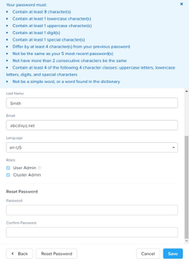
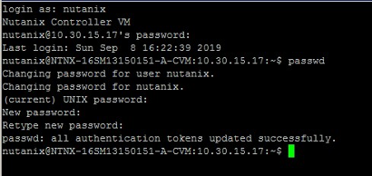

-------------
Appendix
-------------

Updating Default Passwords
++++++++++++++++++++++++++++
	
.. Note::

   Please review the following steps for this exercise. Please DO NOT change the password that is to help avoid logging out of the system for the rest of the exercises, if you forget the password you just reset. 😊

 
Changing the Admin User Password (Change your account instead)
...........................................

1.	Log on to Prism with the **admin** user account and password **(See Cluster Configuration Guide)**.

2.	To change the admin user password for Pris, clicked the **gear** icon to access the **Settings** page. Scroll down and select **Local User Management**.

3.	Click the **pencil** icon to the right of the admin user to access the **Update User** dialog box.

4.	Review the attributes for the admin user using the information in the table below.

 * Username: **admin (grayed out)**
 * First Name: **<Review the settings>**
 * Last Name: **<Review the settings>**
 * Email: **<Review the settings>**
 * Language: **Your preferred language (e.g en-US)**
 * Roles: 
    - **User Admin**
    - **Cluster Admin**

5.	Select **Reset Password**. A list of password parameters will be displayed. Scroll down to see the new change password fields.

 
6.	Click **Cancel** after reviewing the steps above.

7.	You have completed this exercise.

Changing the CVM Nutanix User Passwords
...............................

For this task, you will **review** the steps to change the password for the nutanix user.

1.	Using PuTTY, start an SSH connection to one of the CVMs in your cluster. Log on as the **nutanix** user and the default password (Please refer to Cluster Configuration Information). The following steps can be done on any CVM currently participating in the cluster. After a successful password change, the new password will be synchronized across all CVMs in the cluster.
2.	From the command line interface, use the passwd command to change the password for the **nutanix** user. 
**Warning: Please do not change the password**.

 
3.Type exit to end the PuTTY session.
	
.. Note::  
   If you change the password of the admin user from the default, you must specify the password every time you start an nCLI session from a remote system. A password is not required if you are starting an nCLI session from a Controller VM where you are already logged on.

