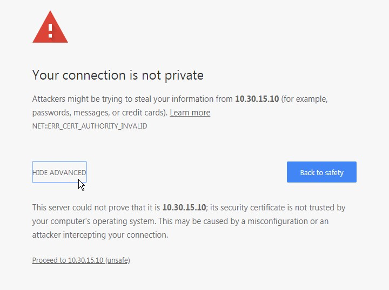

.. Adding labels to the beginning of your lab is helpful for linking to the lab from other pages
.. _example_lab_1:

---------------------------------------
Managing the Nutanix Cluster
---------------------------------------

Conducting Prism Element Initial Setup
++++++++++++++++++++++++++++++++++++++++++++++++++++++++

Open a browser on your VDI session and enter the IP for your Cluster External IP Address shown in your lab guide. This is a floating IP that will run on one of your cluster CVMs. A **Security** page will be displayed, click **Advanced**, then click **Proceed to <IP> (unsafe)**

You should now see the **Prism Home** page.

Configuring an NTP Server
++++++++++++++++++++++++++++

#. Click the :fa:`cog` icon in the upper right corner of the browser window, scroll down the **Settings** list displayed on the left side and select **NTP Servers**.

   .. figure:: images/2.png

#. In the NTP Servers dialog box, review if there is any NTP server that has been added.

#. Type **0.pool.ntp.org** and click **+ Add**

   .. figure:: images/3.png

#. Verify the NTP configuration using nCLI.

   .. note::

   	For Mac user, open a terminal, SSH to CVM IP using the same credential

   a.	Open the PuTTY utility on your virtual desktop.

   b.	In the **PuTTY Host Name (or IP address)** field, type the IP address of the first CVM from your lab handout.

   c.	In the PuTTY terminal window, login using the default CVM credentials. user: **nutanix** and password: **<password> (Please refer to the Cluster Configuration Guide)**

   d.	Once logged in, type the command:

      .. code-block:: putty

        $ ncli cluster get-ntp-servers

   e.	Confirm the IP address you entered in Prism is shown. Type exit to close the PuTTY session.

Using Nutanix Network Interfaces
++++++++++++++++++++++++++++++++++

In this exercise you will familiarise yourself with primary Nutanix interfaces such as Prism Element and nCLI.

#. From the Prism UI, in the upper right corner, click the **User** drop down menu (it will be labeled with the currently logged-in user “admin”) and select **About Nutanix**.

   .. figure:: images/4.png

   Which version of Acropolis (AOS) are you running?

   What is the license type on your cluster?

#. Click **Close** to close the dialog box.

#. At the upper-right, click the question mark (?). From the drop down menu, click **Health Tutorial**. This loads the **Health** Dashboard and starts a **Welcome to Health Page** dialog box, click **Next**. After the simulation loads, click **Next** through the tutorial to view the Health Dashboard features.

   .. figure:: images/5.png

#. When completed, click **OK, got it!** to exit the simulation.

#. Click the **dashboard** drop down menu (currently labeled **Health**). This drop down menu will show of all the dashboards. Select the **VM** dashboard.

   .. figure:: images/6.png

#. From the **Overview** page, locate the **VM Summary** at the middle left. How many virtual machines are shown?

#. In the upper-left corner of the browser window, click **Table**.

   .. figure:: images/7.png

   Are there any VMs listed? If so, what VMs are they? If not, why not?

#. At the upper-middle-right of the **VM Dashboard** page, click to select the **Include Controller VMs** check box and answer the following questions:

   How many cores are allocated to each CVM?

   How much memory is allocated to each CVM?

#. Click the :fa:`cog` icon, scroll through the Settings on the left, select SSL Certificate, and find the following information and make a note of it.

   Key Type:
   Signing Algorithm:

#. Click the magnifying glass found at the top right of the Prism window.

#. Type the letter a in the search bar and click acknowledge alerts. You are automatically redirected to the Alerts dashboard.

   .. figure:: images/8.png

#. Moving the mouse cursor to any alert listed under the **Title** column reveals a hyperlink. Select any alert hyperlink. This switches you to the page dedicated to that alert.

#. Click **Acknowledge** at the upper-right of the page. This logs that the alert has been seen. In the left column, the **Status** should show **Acknowledged**. Select the **X** at the upper-right (immediately to the right of Acknowledge) to close the page.

#. Select the same alert you selected in the previous step and click **Resolve**.

   The **Status** changes to **Resolved**. Alerts which have been resolved do not display by default on the **Alerts** dashboard. Click the **X** once again to exit the page. The alert should no longer be displayed in the list of Alerts.

Exploring Prism Views
++++++++++++++++++++++

In this exercise you will explore various views in Prism.

#. Click the **dashboard** drop down menu and select each of the dashboards in turn. Note which dashboards have a **Table** view, an **Overview** view, and/or a **Diagram** view.

   .. note::

     The last dashboard selected will be represented on the top bar of the UI.

   .. figure:: images/9.png

#. Explore the features available under the **Settings** page ( :fa:`cog` icon) and answer the following questions:

   What is current and maximum setting for **Session Timeout for Current User (UI Settings)**?

   What is the IP of the current name server (Name Servers)?

#. Click the cluster name at the top-left corner of the UI and review the **Cluster Details** window.

#. Explore the functions available under the **User** menu (it will be labeled with the currently logged-in user, **admin**). The several **Download** selections open new tabs in your browser and require internet access.

   .. figure:: images/10.png

#. Now that you are familiar with the Prism management interface, return to the **Home** dashboard by clicking on the Nutanix logo (“**X**”) or by selecting **Home** from the **dashboard** menu.

   .. figure:: images/11.png

Using nCLI
+++++++++++

In this exercise you will learn the Nutanix Command Line Interface (nCLI):

•	Basic commands and getting help

•	Extracting information

•	Use nCLI to build a Storage Container

Accessing nCLI and Using Basic Commands
........................................

In this task you will access the nCLI shell and perform basic commands.

#. In the PuTTY Host Name (or IP address) field, type the IP Address of the any CVM from your Cluster General Information site. (Refer to Cluster Configuration Guide for the credentials detail.)

   .. note::

   	For Mac user, open Terminal, SSH to CVM IP using the same credential

    .. code-block:: bash

      ssh -l nutanix <CVM-IP-ADDRESS>

#. From the command prompt, type ncli to enter the nCLI shell.

   .. figure:: images/12.png

#. Type help or hit the **tab** key twice to view all possible commands from within the nCLI.

#. To display help for the datastore entity, type the command:

   .. code-block:: putty

    <ncli> datastore help

#. To get help on the container entity, type the command:

   .. code-block:: putty

     <ncli> container help

   What command do you enter to get nCLI help for user accounts?

   What command do you enter to list user accounts?

Extracting Information
...............................

In this task you will use the nCLI shell to answer the following questions.

#. Type storagepool list. How many storage pools does the cluster have?

#. Type the command that lists all the storage containers in the cluster. How many storage containers does the cluster have?

   .. code-block::

    ncli   
    <ncli> container list

#. Refer to the storage container named **SelfServiceContainer** and answer the following questions:

   How much free space is available in the storage container?

   How much space has been used in the storage container?

   What is the compression setting?

#. Find and use the command to list all virtual machines in the cluster. How many virtual machines are there in the cluster? Does this include or exclude CVMs?

#. Type cluster info to display cluster information. Answer the following questions:

   What AOS software version is running on the cluster? (Compare the output from the cluster version command.)

   How many nodes and blocks are in the cluster?

   What is the cluster time zone?

#. Type **exit** to leave the **nCLI** shell and return to the **Bash** shell.

#. You can combine Bash shell commands and nCLI commands to filter and format nCLI output. For example, to count the number of SSDs in the cluster, type the command:

   .. code-block:: ncli

      ncli disk list | grep SSD | wc -l

   .. note::

   The final character in the above command is the letter “l” (lowercase “L”).

   How many SSDs are in the cluster?
   How many HDDs are in the cluster?

#. In the Prism UI, confirm your findings by switching to the Hardware dashboard, clicking the Table tab, then clicking the Disk button. Review the Tier column to confirm.

Using nCLI to Build a Storage Container
.................................................

In this task you will create and delete a storage container using nCLI.

#. In your PuTTY connection to one of your CVMs, type ncli to enter the nCLI shell.

#. To get help with the container create command, type:

   .. code-block:: ncli

      <ncli> container create help

#. The name of the storage pool is a required argument to the container create command. Get the unique name of the default storage pool by typing the following command:

   .. code-block:: ncli

      <ncli> storagepool list

#. Create a container named **cli-container-<lastname>** by typing the following command:

   .. code-block:: ncli

     <ncli> container create name=cli-lastname sp-name=default-storage-pool-#####

   .. note::

    Where ##### is the cluster ID based on what you discovered in the previous step. <lastname> is your surname.

#. From the Prism UI, click the **Dashboard** menu and go to **Storage > Table > Storage Container** to confirm the container is created.

#. Click to select **cli-container-<lastname>**.

#. Immediately below the table of containers and at the far right, click **Delete**. In the confirmation dialog box, click **Delete** to confirm the action.

#. Verify that **cli-container-<lastname>** has been deleted.

#. Return to your SSH (PuTTY terminal) session.

#. Verify that your container has been deleted:

   .. code-block:: ncli

     <ncli> container list
