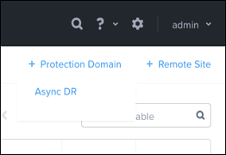
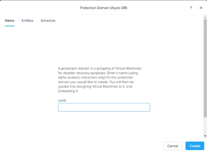
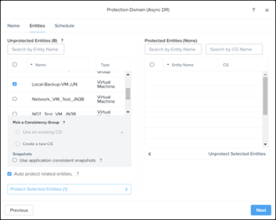
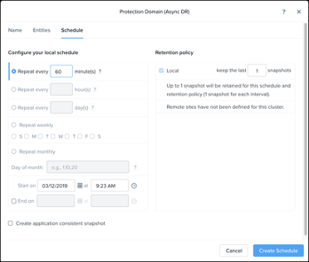
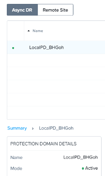
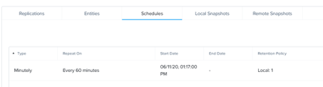
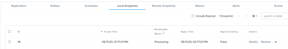
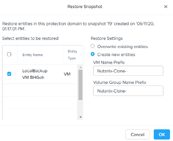

.. Adding labels to the beginning of your lab is helpful for linking to the lab from other pages
.. _example_lab_10:

-------------
Data Protection
-------------

Creating Protection Domains and Local VM Protection (TimeStream)
++++++++++++++++++++++++++++++++++++++++++++++++++++++++++++++++

In this exercise you will work individually to configure a protection domain to provide a backup for your Windows virtual machine to your local cluster.

1.  Log on to Prism Element as the **admin** user.

2.  Switch to the **VM** dashboard and click the **Table** tab.

3.  Select your **Windows-<your initials>** virtual machine and click Clone.

4.  Name the new clone **Local-Backup-VM-<your initials>** and click **Save**.

5.  Click the **Update** link for the VM you just cloned.

6.  Scroll down in the **Update VM** window and ensure any CD-ROM devices are empty. If they are not empty, click the **eject** icon to ensure they are empty.

7.  Click **Save** and power on the cloned VM.

8.  Switch to the **Data Protection** dashboard. Click **OK** when the **Protection Domain Warning** dialog appears.

9.  Click the **Table** tab.

10. Click **+ Protection Domain** and then select Async DR.

 
11. In the **Protection Domain (Async DR)** window, in the **Name** text box, enter **LocalPD-<your initials>**.

 
12. Click **Create**.

13. Under **Unprotected Entities**, click to select the **Local-Backup-VM-<your initials>** VM.

 
14. In the lower-left corner of the window, click Protect Selected Entities (1).
  
.. Note::

   You should see the protected Windows VM move to the right column labelled Protected Entities.

.. figure:: images/4.png
 
15. Click **Next**.

16. Click **New Schedule**.

17. Click the radio button for **Repeat every… minutes** and enter **60** into the text box.

 
18. Leave all other fields at their default values and click **Create Schedule**.

19. Click **Close**.

20. In the **Protection Domain** table, click to select your **protection domain**.

21. In the lower left side of the **Protection** dashboard, look at the **PROTECT DOMAIN
DETAILS** box and verify the **Protection Domain** mode is **Active**. 

 
22. Below the **Protection Domain** table, click the **Schedules** tab and verify the **Every 60 minutes** schedule.

 
23. Select the **Local Snapshots** tab. A snapshot is automatically taken when the protection domain is created. If you do not see a snapshot, wait a few minutes and check again.

 
24. Click the **Restore** link on the right side of the snapshot entry in the **Local Snapshots** table.

25. In the **Restore Snapshot** window, click the checkbox for the **Local-Backup-VM-<your initials>** VM.

26. Ensure the **Create new entities** radio button is selected, leave all other fields at their default values and click **OK**.

 
27. Switch to the **VM** dashboard and click the **Table** tab.
28. Verify the restored VM named **Nutanix-Clone-Local-Backup-VM-<your initials>** is present.
  
.. Note::
   The cloned restored VM will be in a powered off state.

