.. Adding labels to the beginning of your lab is helpful for linking to the lab from other pages
.. _example_lab_11:

-------------
Prism Central
-------------

********Working with Prism Central
++++++++++++++++++++++++++

You will work through the lab using Prism Central interface. Your cluster can only be registered to one Prism Central Server at a time. 

1.  In Prism Element UI, ensure that you see the screenshot that displays Prism Central status as **OK**.
 
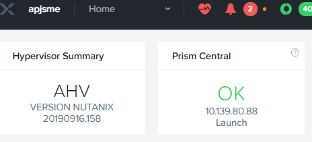

2.  In the **Prism Central** widget, click **Launch**.
3.  A new browser tab should open. Log on to Prism Central with the **admin** user. Prism Central displays the **Main** dashboard.

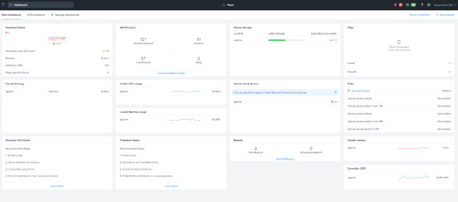
 
Using Prism Central's Basic Features
+++++++++++++++++++++++++++++

In this exercise you will explore some of basic features of Prism Central.

1.  If needed, log on to Prism Central and access the **Main** dashboard.
  How many clusters are registered with this Prism Central instance?

2.  Click on your cluster name from any widget where it is listed (you may need to refresh your browser). This will take you to the **Clusters Summary** page.

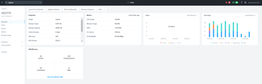
 
3.  Explore the links down the left side of the browser window to see what information has been imported to the Prism Central database. When finished, click the Nutanix **X** in the upper middle of the UI to return to the **Main** dashboard.

Creating a Custom Dashboard
+++++++++++++++++++++++

In this exercise you will create a custom dashboard.

1.  If necessary, log on to Prism Central.

2.  At the upper left, click **Manage Dashboards**.

3.  In the pop-up, click **+New Dashboard**.

4.  Type a name for the dashboard (i.e. HPE-<your initials>), then click **Save**.

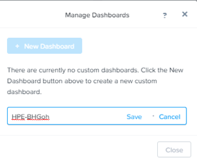
 
5.  When you click on the new dashboard name, you should see a blank page and the option to **Add Widgets**.

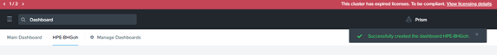
 
6.  Click on the **Add Widgets** link in the middle panel or on the add widgets icon at the upper right.

7.  In the left panel, select the **Cluster Quick Access** widget from the list of predefined widgets.
At the lower right, click **Add to Dashboard**.
 
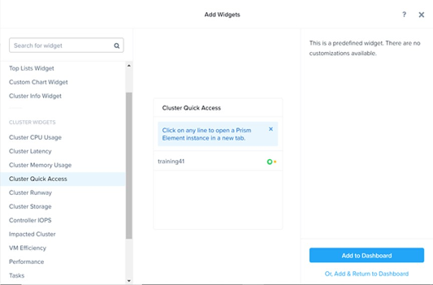

8.  From the left panel, select the **Custom Chart Widget** and create a custom widget. In the right panel, experiment with the configuration options to define a widget to your needs. 
  
 .. Note::
    When you click in the Entity Search field the options available for selection are based on the Entity Type setting.

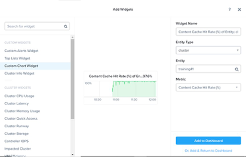

9.  When completed, click **Add & Return to Dashboard** at the lower right to display your finished dashboard.

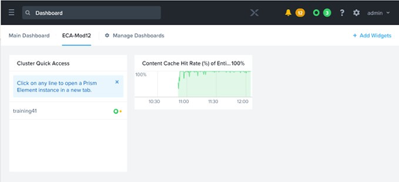
 
Creating a Custom Report
+++++++++++++++++++++++

**Group Exercise**

In this exercise you will create a custom report using Prism Central.

1.  From the **Main** dashboard, click the hamburger menu (the three-lined icon) in the upperleft corner of the browser window. This will display dashboard options on the left side of the browser.

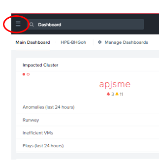
 
2.  In the **dashboard** menu, hover over **Operations** and then click **Reports**.

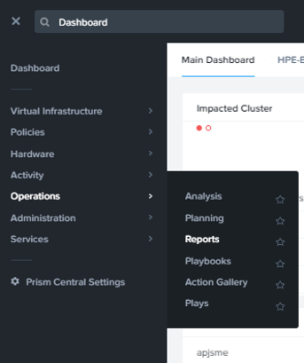
 
3.  Click the **Cluster Efficiency Summary** check box and click the **Actions** menu above.

4.  Select **Run** from the menu to display the **Run Report** window. Populate the empty fields as follows:

 * Report Instance Name: **<your initials>-PC-Report**
 * Description: Enter any text you would like
 * Time Period For Report: **Last 24 hours**
 * Report Format: **PDF**
 * Additional Recipients: Leave this field blank

5.  Click **Run**.

6.  Click the **Cluster Efficiency Summary** report name (click the text on the report name not the check box). You should see the PDF instance of the report you have just run.

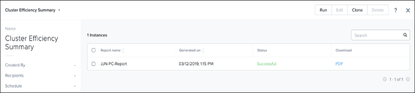
 
7.  Click the **PDF** link to download the PDF report. This will be saved to the downloads folder on your VDI desktop.

8.  Open the downloaded PDF to view the report.

9.  Scroll through the report to see what information it contains. 
  
.. Note::  
   Your Prism Central instance has only been running a short time and may not show any data in the report’s graphs and other widgets. Typically,

you would run reports after Prism Central has been running for several days or weeks.

10. Close the **Cluster Efficiency Summary** page and click the X on the top bar to return to the **Main** dashboard.

Creating a "What-If" Scenario
+++++++++++++++++++++++++++++

In this exercise you will explore how to create a planning session to forecast future needs based on current growth.

1.  From the **Prism Central Main** dashboard, click the hamburger menu at the upper left and select **Operations -> Planning**. 

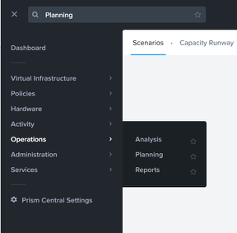
 
2.  At the upper right, click **New Scenario** to open the **Scenario Definition** tab.

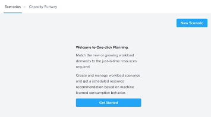
 
3.  In the left panel, select your cluster from the **Cluster** drop down menu.

4.  In the **Target** box, select **12 months**.

5.  In the right panel area, under **Resources**, you can choose **Add/Adjust** to define your nodes and node configurations. Review the options and keep the existing hardware setting.
6.  In the left panel, check the **Capacity Configuration** box to modify or add reservation on cluster capacity.

.. figure:: images/14.png
 
7.  In the left panel next to **Workload**, click **Add/Adjust** to add or adjust the workload that will be placed on the cluster with the following values:

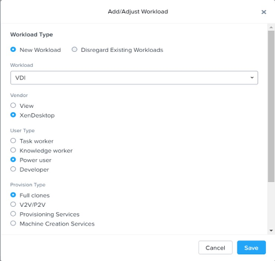
 
Scroll down and enter **500** into the **Number of Users** text box. 

8.  Click **Save**. The saved VDI configuration is shown in the left panel and the check box to **display the scenario** will already be selected. Click **Recommend** to review the recommendations (if any).
 
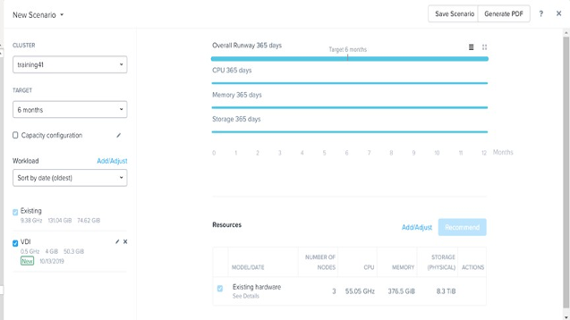

9.  Click the **Save Scenario** button to save the scenario.
 
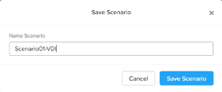
