.. Adding labels to the beginning of your lab is helpful for linking to the lab from other pages
.. _example_lab_7:

-------------
Migrating Workloads with Nutanix Move
-------------

Setting up a Move VM
+++++++++++++++++++++
In this exercise, you will work towards deploying Nutanix Move VM on a Nutanix AHV cluster. 

  .. NOTE::
     Since you are in a shared resource, Move could be already been setup by the time you reached this exercise, if this is so, please reviewed the steps below and proceed to **Configuring a Migration Plan** .

1.  In your Prism Element UI, identify the IP address of the Move VM.
2.  Open a new tab in your browser and enter the IP of your **Move** VM.
3.  Select the **I have read and agreed to terms and conditions** check box and click **Continue**.
 
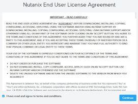

4.  Click **OK** in the **Customer Experience Program** popup window.
5.  Set a new password for the **nutanix** user. Set the password as **Nutanix/4u** with the CAP letter N).
6.  Log on using the new user and password.
7.  In the Move Supports dialog bog, click Continue.

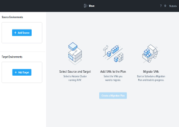
 
Configuring Move
+++++++++++++++++

1.  The **Move** dashboard displays **Source Environments**, **Target Environments** and **Migration Plans**.
2.  On the upper left side of the Move UI, click **+ Add Source**.
3.  In the **Add Source Environment** dialog box, select **VMware ESXi**.

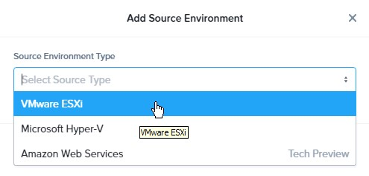
 
4.  Enter the following values into the respective fields:
o Source Name: **VMWare vCenter**
o Environment Name: **Source**
o vCenter Server: **<vCenter IP Address> See Cluster Configuration Guide**
o vCenter Password: **See Cluster Configuration Guide**

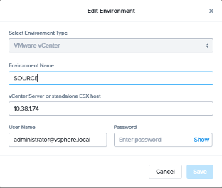
 
a.  Click **Add**.
5.  In the new **SOURCE** box, click the **ellipse (…)** in the upper right corner and in the presented menu, choose **Refresh**. This will initiate a query to update Move with the latest changes in vCenter.

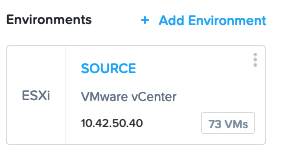
 
6.  In the left panel, click **+ Add Target** and enter the following values:

Target Name: **<your cluster name>**
Nutanix Environment: **<cluster external IP address> See Cluster Configuration Guide**
User Name: **admin**
Password: **See Cluster Configuration Guide
**
a. Click **Add**.

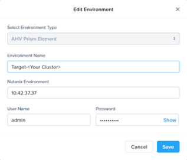
 
7.  In the new **Target <your cluster name>** card, click the **ellipsis (…)** in the upper right corner and in the presented menu choose **Refresh**. This will initiate a query to update Move with the latest changes in your Nutanix target cluster.

Configuring a Migration Plan 
++++++++++++++++++++++++++++

In this exercise, you will create a migration plan and initiate the migration.

   .. NOTE::
   In this part of the exercise, you are to create a migration plan and initiate the migration of virtual machines which are located in the ESXi SOURCE to the TARGET Cluster you are currently working on. There are already pre-created VMs mapping to your User Account name of your VDI session. The target machines you are to migrate should corresponding to you VDI User  Account name. e.g Win2012-PHX-POC037-User01, Window2012-PHX-POC37-User02 etc 

1.  Click **+ New Migration Plan** on the top right side of your screen to create a new migration plan.

2.  Enter Plan Name as: Migration Plan <your initials>

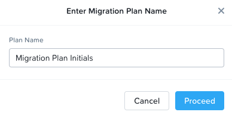
 
3.  Click **Proceed**.

4.  In the source target, select **SOURCE – VMWare vCenter** as the source of your migration.

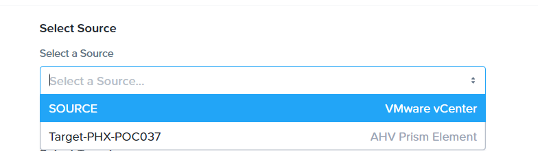
 
5.  In the target, select **Target-<your cluster name>** as the destination of the migration.

6.  Select **default-container-#########** as your target container and click **NEXT** to proceed.

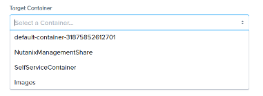
 
7.  In **Select VMs** in step2 of the migration plan, please click on the + symbol beside the machine of your VDI User Name（eg: PHX-POC043-User01）. On the right side of the screen, the selected source VM will appear in your screen. 

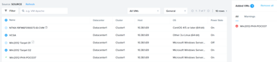
 
8.  Click **Next** to proceed to Network Configuration.

9.  Select Unmanaged Client as the Target Network and leave Test Network (optional) as default and click NEXT to proceed.

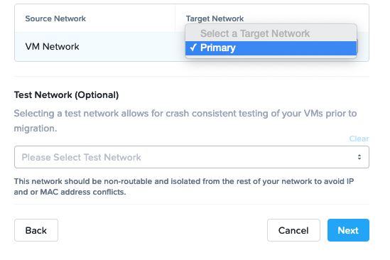
 
10. In **VM Preparation** step, key in the following parameters:

 * Preparation Mode: **Automatic**
 * Credentials for Source VMs:  Under Windows VMs key in the **User Name** and **Password** (refer to Cluster Configuration Guide)
 * Override Individual VM Settings: **Leave as default**
 * TimeZone: **Leave as Default**
 * Retain MAC Addresses from the Source VMs: **Ensure box is UNCHECKED**
 * **Btpass Guest Operations on Source VMs: Ensure box is UNCHECKED**
 * Manage Settings for Individual VMs: Leave as Default
 * Schedule Data Seeding: **Ensure box is UNCHECKED**
  
Click **NEXT**.

11. Review your final settings in **Summary** page, and click **Save** and Start to proceed with the migration. 

12. Under **Migration Plans** page, you will be able to monitor the migration progress:

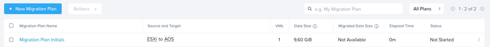
 
13. Click on **In Progress** and to see the migration in detailed.

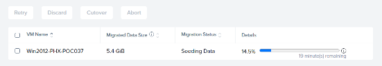
 
14. Once the status bar has hit 100%, and display the Cutover status as shown below, you are ready to perform a cut-over.

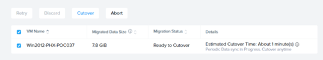
        
15. Click on the **Cutover** button:

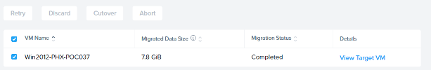
 
16. And once the Migration Status shows Completed, you should be able to view the target VM.

17. Go into your Prism Element UI and you should view the newly migrated VM under the VM list.

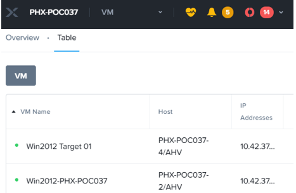
 
18. Congratulations! You have successfully performed a VM migration using Nutanix Move.
