.. Adding labels to the beginning of your lab is helpful for linking to the lab from other pages
.. _example_lab_9:

-------------
Data Resiliency
-------------

Configuring High Availability
+++++++++++++++++++++++++++

In this exercise you will observe the impact and benefits of the VM high availability feature.

 .. Note::

   Since the cluster is a shared resource, if you notice that the setting has already turn on, please review the steps and then proceed to Step 7.
   

1.  Verify the **HA-Lab-<initials>** VM is powered on.

2.  Click the **gear** icon, scroll down under **Settings** and under **Data Resiliency** click **Manage VM High Availability**.

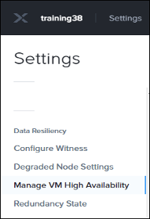
 
3.  Read the text in the **Manage VM High Availability** dialog box. Note that when VM high availability is disabled, AOS will not reserve or guarantee memory to start virtual machines in the event of a node failure.

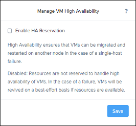
 
4.  Click **Enable HA Reservation**.(if this has already been turned on, please review the next steps and skip to step 7)

5.  Click **Save**.

6.  Click **OK**.
  
 .. Note::

    AOS is now reserving memory to guarantee VMs will be started in the event of a node failure.

7.  Switch back to the **VM** dashboard.

8.  Follow the steps below to create clones of **Windows 2012 VM** and rename them as **HA-Lab-<initials>** virtual machine.

  a.  Click to select the **Windows 2012 VM** VM.

  b.  Click the **Clone** link in the links below the table of VMs.

  c.  Double the memory allocation from **8** to **16** and keep everything else default. 

  d.  Click **Save**.

  e.  When the cloning process is complete and a new virtual machine appears in the VM dashboard, select the new clone and click **Power On**.

  f.  Repeat the previous steps to create additional clones until Prism no longer allows you to power on the new clone. For each additional clone, ensure the VM name is unique and set the memory allocation to **32**. 

9.  When the **Power On** action fails, view the status message at the top of the browser window.

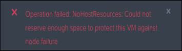
 
10. Click the **gear** icon, scroll down under **Settings** and under **Data Resiliency** click **Manage VM High Availability**.

11. In the **Manage VM High Availability** dialog box, deselect **Enable HA Reservation** and click **Save** to disable VM high availability.

12. Switch back to the **VM** dashboard.

13. Click to select the last VM you cloned (the one that failed to power on) and click the **Power On** link in the row of links below the table of VMs.
     * Were you able to power on the VM this time? Why?
     * What does this tell you about using the VM high availability feature? 

1.  Delete all the **HA-Lab-<initials> VM** instances created in this lab exercise.
  
.. Note::

   Do not delete any other VMs at this time.

2.  When you are prompted, click the **Delete all snapshots**? check box on this VM and click **Delete**. 
 
  
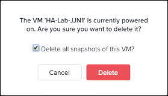

.. Note::

   Although no VM snapshots were created for these VMs, it is typically a good idea to delete snapshots when you delete VMs.

 
Configuring Virtual Machine Affinity
+++++++++++++++++++++++++++

You can specify placement policies for virtual machines on an AHV cluster. These placement policies use affinity lists to specify the hypervisor node(s) that can host an individual VM. The placement policy and list are used when VMs are created, powered on, migrated and after failure recovery.
If you choose to apply the VM-host affinity policy, you will restrict Acropolis HA and Acropolis Dynamic Scheduling (ADS) in such a way that a virtual machine cannot be powered on or migrated to a host that does not conform to requirements of the affinity policy.

Cloning and Editing VM Settings
......................................

1.  Working individually, clone your original Windows VM. Go to **VM** dashboard > **Table** and select (highlight) your **Windows 2012** VM and click **Clone**.

 
2.  In the **Clone VM** dialog box, change the hostname to **Affinity-<your_initials>**.
3.  Scroll down to the **Network** section and delete the **vlan.0** Rx-Automation- Network by clicking the **x**.

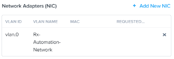
 
4.  Click **Save**.
  
 .. Note::
 
    The virtual network is removed to save on IPs. Network access is not required for these exercises.

5.  Power on the new clone VM.

Creating a Host Affinity VM-to-Host Rule
........................................

In this task you will choose the hosts a VM can run on. Choices are limited on a three or four node cluster and typically, these rules are applied in larger environments and are set based on performance needs, application requirements, location, and so on.

1.  From the **VM** dashboard, locate your newly created affinity VM and determine which node is the current host.

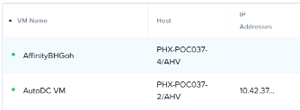
 
This example shows the VM being hosted on node **4**.

2.  Create an affinity rule for your VM. Select your **Affinity-<your_initials>** VM and click **Update**.

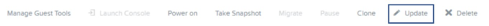
 
3.  In the **Update VM** dialog box, scroll down to the **VM Host Affinity** section and click **+ Set Affinity**.

.. figure:: images/9.png
 
4.  In the **Set VM Host Affinity** dialog box, the current node where the VM resides is automatically selected. If you saved this, the only node the VM will ever run on is node **4**. If you deselect the current node and select another node, when saved, the VM will automatically migrate.
 
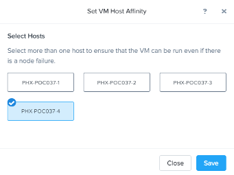
  
.. Note::

   A minimum of 2 hosts should be selected to allow for maintenance mode, rolling code upgrades, and node and host failures. 

5.  Deselect the current node and select your other two nodes.
Our example shows node **4** deselected and nodes **1** and **2** selected.
 
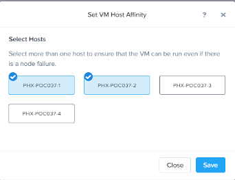

6.  Click **Save** twice.

7.  Watch the **Host** column in the **VM** dashboard. After a few minutes you will see the original node for your VM change to one of the nodes selected in your affinity list. You can also follow the process using the **Tasks** icon or **Tasks** dashboard.

8.  With the affinity rule in place, verify you can no longer place your VM on the host it was previously running on (not selected in your affinity list). Select your **Affinity<your_initials>** VM and select **Migrate**.
 

9.  In the **Migrate VM** dialog box, select the drop down menu and note the original node is not listed.
 
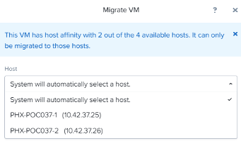

10. Select the node the VM is not running on or allow the system to select one for you. Click **Migrate**.

11. Verify your VM migration task successfully completed. 

Configuring Virtual Machine Anti-Affinity
++++++++++++++++++++++++++++++++++++++++++
 
Affinity rules establish a relationship between a virtual machine and one or more hosts. Antiaffinity rules are used to prevent specific virtual machines from being placed on the same host. This provides an administrative intervention to the Acropolis Dynamic Scheduler (ADS) and can be used to balance workloads across available hosts to man-age and/or prevent over utilization of individual VM resources. Anti-affinity rules are configured using the command line interface on a CVM.

Anti-affinity is a preferential (soft) policy that can be overruled by the Acropolis Dynamic Scheduler (ADS) feature in the event of severely constrained resources. Typically, anti-affinity rules are applied in larger environments and not usually found on three or four node clusters. 

Cloning VMs
....................

In this task, you will clone two new VMs for the anti-affinity tasks and ensure both VMs are running on the same node.
1.  From the **VM** dashboard, clone your **Windows 2012 VM VM**. Name the clone **Antiaffinity-WIN-<your initials>** and remove the virtual network configuration. Click **Save**.

2.  Clone your original **CentOS VM** VM. Name it **Antiaffinity-LNX-<your initials>** and remove the virtual network configuration. Click **Save**.

3.  Power on both VMs.

4.  Take note of the hosts the anti-affinity VMs are currently running on by looking at the **Host** column. 

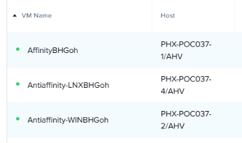
 
This example shows both VMs currently running on node **4** and **2** respecitvely.

5.  If both VMs are running on the same host, skip to Task 2, otherwise continue with the next step.

6.  Migrate your **Antiaffinity-WIN-<your initials>** VM to the same host where the **AntiaffinityLNX-<your initials>** VM is running.

7.  Confirm both VMs are now running on the same host.

Creating a VM-to-VM Anti-Affinity Rule
..............................................

In this task you will create an anti-affinity group using the command line interface on one of your CVMs. 

1.  Using PuTTY, start an SSH session to any of the CVMs using an IP from your lab handout.

2.  Log on to the CVM and enter the Acropolis Command Line Shell, type:

.. code-block:: bash

   acli
   <acropolis>

3.  Create a VM Group called **AA-Group-<your_initials>**. This will be used to identify the VMs for the anti-affinity rules. Type:

.. code-block:: bash

   <acropolis> vm_group.create AA-Group-<your_initials>

4.  List the newly created VM group. Type:

.. code-block:: bash

   <acropolis> vm_group.list

5.  Display the list of VMs available to be added to the VM group. Type:

.. code-block:: bash

   <acropolis> vm.list

6.  Add both of your anti-affinity VMs to the VM group. VM names are case sensitive. The CLI format is all on one line:

.. code-block:: bash 

   <acropolis> vm_group.add_vms  <VM Group>  vm_list=<VMs comma separated>
   <acropolis> vm_group.add_vms  AA-Group-<your_initials> vm_list=Antiaffinity-WIN-
   <your_initials>,Antiaffinity-LNX-<your_initials>

7.  Verify both VMs have been added to the VM group. Type:

.. code-block:: bash

   <acropolis> vm_group.list_vms  AA-Group-<your_initials>

8.  Apply the VM-to-VM anti-affinity policy to the VM group.Type:

.. code-block:: bash

   <acropolis> vm_group.antiaffinity_set  AA-Group-<your_initials>

Applying the policy, enforces the rule that the VMs listed in the VM group are not allowed on the same node under normal circumstances. This can be overruled by ADS in the case of resource constraints that would prevent these VMs from starting.

9.  Review the anti-affinity VMs in the VM dashboard. One of the VMs should have migrated to a different host. If they are still on the same host, you could expedite the anti-affinity process by power cycling one of the VMs in the group. Type:

.. code-block:: bash

   <acropolis> vm.off Antiaffinity-WIN-<your_initials>
   <acropolis> vm.on Antiaffinity-WIN-<your_initials>
